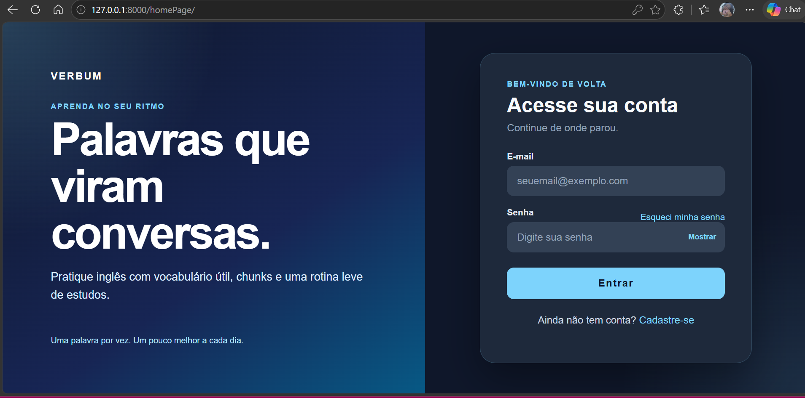
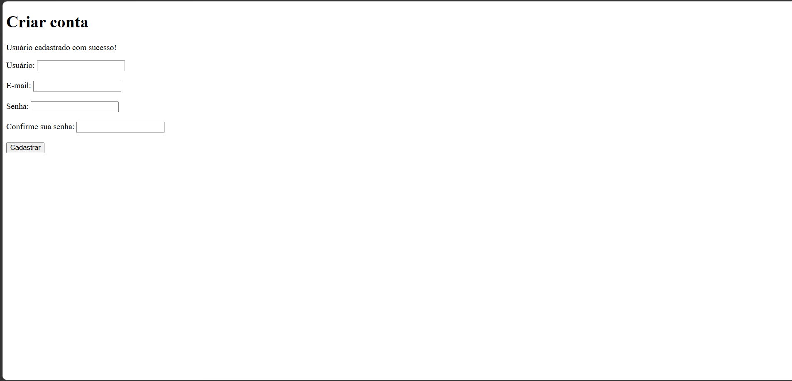
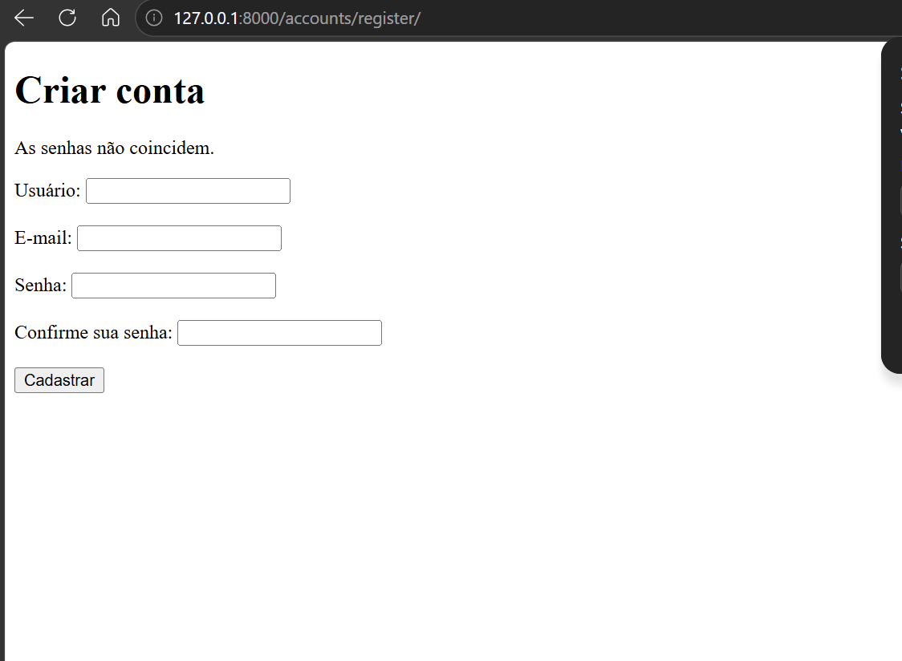
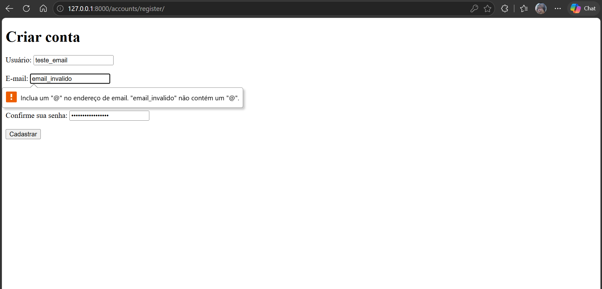
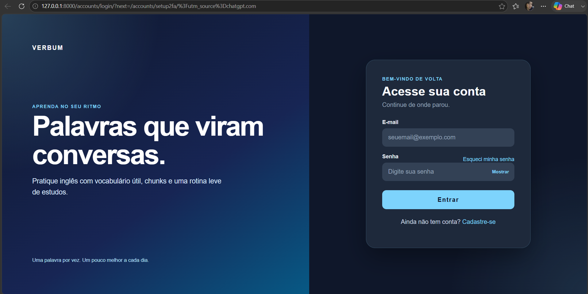
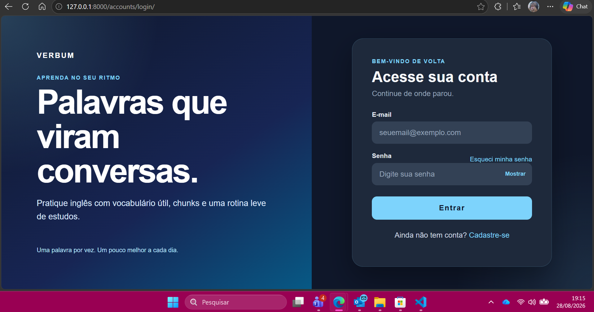

# Testes da Aplicação

## Projeto Integrador - Autenticação e Gestão de Credenciais

Este documento apresenta os testes realizados na aplicação Verbum durante a etapa de desenvolvimento.

Os testes foram realizados utilizando o front-end da aplicação, conforme solicitado nas orientações do Projeto Integrador.

---

## 1. Verificação do ambiente

Foi executado o comando:

py manage.py check

### Resultado

**Teste aprovado.**

O Django realizou a verificação do projeto sem apresentar erros.

---

## 2. Inicialização da aplicação

A aplicação foi executada utilizando:

py manage.py runserver

O servidor foi iniciado corretamente em:

http://127.0.0.1:8000/

### Resultado

**Teste aprovado.**

A aplicação foi inicializada corretamente.

---

## 3. Acesso à tela de login

Foi acessada a rota:

/accounts/login/

A tela apresentou:

- Campo de e-mail;
- Campo de senha;
- Botão Entrar;
- Opção para visualizar a senha;
- Opção de recuperação de senha;
- Opção de cadastro.

### Evidência

### Resultado

**Teste aprovado.**

---

## 4. Cadastro de usuário

Foi realizado o cadastro de um novo usuário através do front-end.

A aplicação apresentou a mensagem:

"Usuário cadastrado com sucesso!"

### Evidência

### Resultado

**Teste aprovado.**

---

## 5. Validação da confirmação de senha

Foi realizado um teste utilizando senhas diferentes nos campos de senha e confirmação.

A aplicação apresentou:

"As senhas não coincidem."

### Evidência

### Resultado

**Teste aprovado.**

---

## 6. Validação do formato do e-mail

Foi informado um endereço de e-mail inválido.

O navegador impediu o envio do formulário e apresentou a validação referente ao formato do endereço.

### Evidência

### Resultado

**Teste aprovado.**

---

## 7. Usuário já existente

Foi realizada uma tentativa de cadastro utilizando um nome de usuário já existente.

O banco de dados impediu a duplicação através da restrição de unicidade:

UNIQUE constraint failed: auth_user.username

### Resultado

**Teste identificado.**

A regra de unicidade está funcionando, porém o tratamento da exceção ainda precisa ser aprimorado para apresentar uma mensagem amigável ao usuário.

---

## 8. Login válido

Foi realizado o teste utilizando credenciais válidas cadastradas previamente.

O formulário de login deve encaminhar o usuário para o fluxo de autenticação da aplicação.

### Evidência

### Resultado

**Teste aprovado.**

---

## 9. Proteção de páginas sem autenticação

Foi realizada uma tentativa de acesso ao painel sem possuir uma sessão autenticada.

A aplicação redirecionou o usuário para a tela de login.

### Evidência

### Resultado

**Teste aprovado.**

---

## 10. Proteção da configuração do 2FA

Foi realizada uma tentativa de acesso à configuração do 2FA sem autenticação.

A aplicação impediu o acesso direto.

### Evidência

### Resultado

**Teste aprovado.**

---

## 11. Proteção da verificação do 2FA

Foi realizada uma tentativa de acesso à verificação do 2FA sem autenticação.

A aplicação impediu o acesso direto.

### Evidência

### Resultado

**Teste aprovado.**

---

## 12. Resumo dos testes

| Teste | Funcionalidade | Resultado |
|---|---|---|
| 01 | Verificação do ambiente | ✅ Aprovado |
| 02 | Inicialização da aplicação | ✅ Aprovado |
| 03 | Tela de login | ✅ Aprovado |
| 04 | Cadastro de usuário | ✅ Aprovado |
| 05 | Confirmação de senha | ✅ Aprovado |
| 06 | Validação de e-mail | ✅ Aprovado |
| 07 | Usuário duplicado | ⚠️ Tratamento pendente |
| 08 | Login válido | ⏳ Em teste |
| 09 | Painel sem autenticação | ✅ Aprovado |
| 10 | Setup 2FA sem autenticação | ✅ Aprovado |
| 11 | Verify 2FA sem autenticação | ✅ Aprovado |

---

## 13. Observações

Os testes foram realizados utilizando exclusivamente a interface da aplicação.

As evidências dos testes estão disponíveis no diretório:

docs/evidencias/

O tratamento da tentativa de cadastro de usuário já existente permanece como melhoria futura.

O teste de login válido será considerado concluído após a validação do fluxo completo de autenticação.
